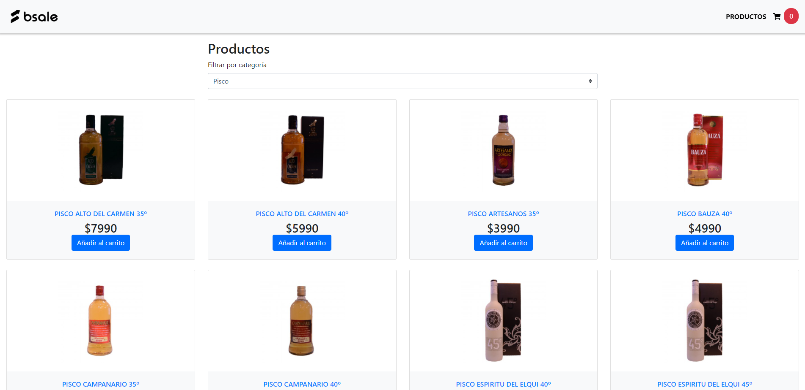

# Bsale Front End

Bsale consiste en una aplicación para la visualización de productos en la cual se incluye el filtro según categoría de este y función para agregar a un carrito de compras.

## Contenido  
Este proyecto cuenta con 1 sola rama en la cual, se encuentra el front end de la aplicación.  

## Funcionalidad

<li> Buscar según categoría de producto
<li> Agregar a carrito (inc. quitar productos)

## Tecnologías

<li> HTML5
<li> CSS3
<li> JavaScript
<li> Bootstrap

## Demo

Si quieres ver una demo del proyecto, puedes acceder al deploy en el siguiente enlace: <a href="https://gifted-yalow-bfed1b.netlify.app/">Bsale Test </a>

## Cómo clonar

Dado que la aplicación no cuenta con ningún requisito en especifico, para clonarla solo basta con ejecutar el comando: 
~~~ 
git clone https://github.com/CCARTES4/test-Bsale.git
~~~

## Instalación 

La instalación no requiere de ningun paquete adicional, por lo tanto, con solo clonar y abrir el archivo "index" ya estará corriendo.

## Autor

<a href="https://github.com/CCARTES4"> CCARTES4</a>